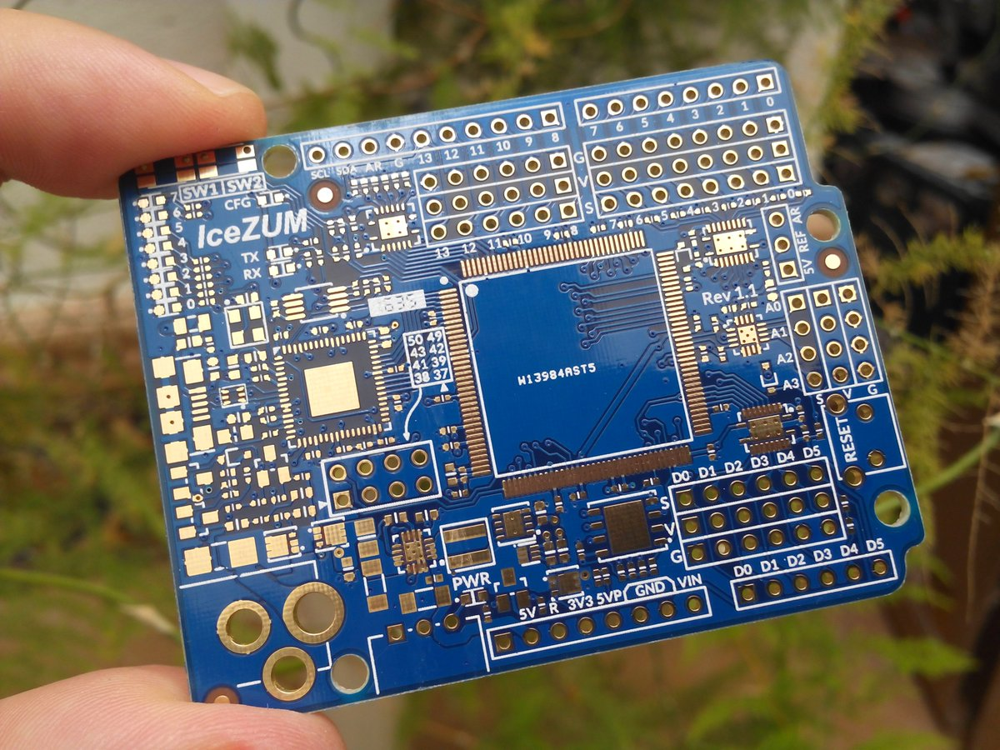

# PCB

## ¿Qué es una PCB?

Un PCB es el soporte donde añadiremos los componentes que pueden ser de 2 tipos:
* Pasantes (Through-Hole): que necesitan agujeros para conectarse

* De superficie (Surface-mount SMD): Se sueldan en la superficie

En la pcb deben estar los "pads" donde se soldarán los componentes además de indicaciones para su correcto posicionamiento (**serigrafía**)

Entre los distintos componentes están las **pistas** que los conectan

Las pcbs pueden tener **varias capas** por lo hacen falta hacer agujeros, **vías** que las conecten entre sí (también hay agujeros para fijar la placa)

También se suele crear un **máscara**, que es una capa de pintura aislante para evitar cortos al soldar y para que no se oxide el cobre de las pistas.

Además hay que tener en cuenta muchos más factores como son la disipación del calor, las interferencias entre los componentes, etc....

Los componentes SMD se pueden soldar fácilmente de manera automática

