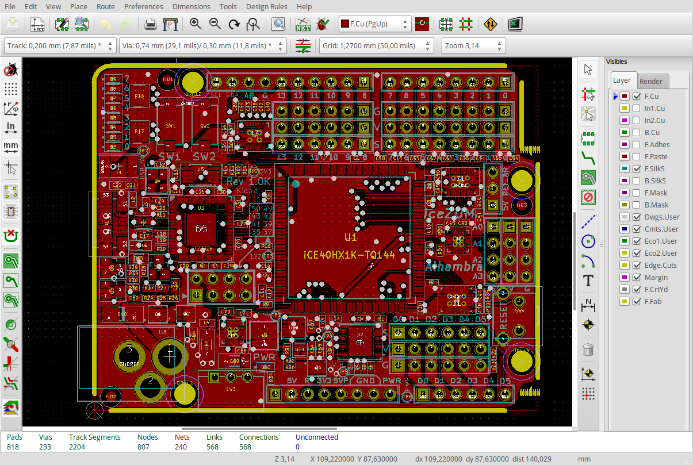
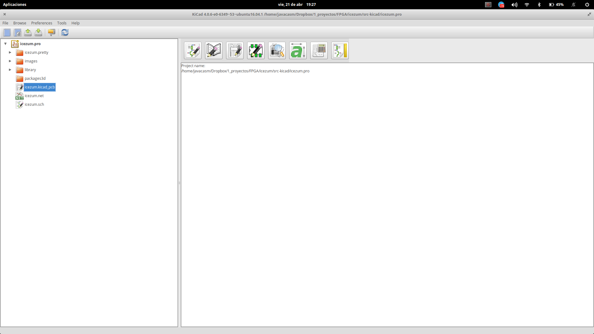
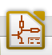
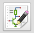
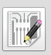
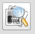
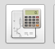
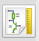

# Open Hardware Day

#  Kicad: diseñando electrónica con software libre

## José Antonio Vacas @javacasm

### ¡¡Este tutorial está sin terminar!! es un trabajo en continuo progreso...

## ¿Qué es [Kicad](http://kicad-pcb.org) (http://kicad-pcb.org)?

Es un paquete de aplicaciones open-source formado por diferentes componentes pensados para trabajar las distintas fases de la creación y desarrollo de circuitos electrónicos.

Actualmente [recibe apoyo](http://kicad-pcb.org/about/kicad/) de entidades tan importantes como el CERN, la fundación Raspberry o Arduino.

## Documentación

Existe mucha [documentación](http://kicad-pcb.org/help/documentation/) y traducida a varios idiomas

También disponemos de [diferentes tutoriales](http://kicad-pcb.org/help/tutorials/) y [videotutoriales](http://kicad-pcb.org/help/tutorials/#_video_tutorials) desde un nivel básico hasta uno tan avanzado que nos enseña a [diseñar una placa compatible con Arduino UNO](https://www.youtube.com/user/XploreLabz/videos)

Personalmente estoy siguiendo la serie [8 vídeos de Applied Electronics](https://www.youtube.com/playlist?list=PLasv3NGTWxRtv5-lh-6zYzKbRS5hVgy1C), que aunque va algo lenta empieza por el orden que a mi me parece más lógico. También tengo apuntado para ver el [vídeo de Windsor Schmidt](https://www.youtube.com/watch?v=zK3rDhJqMu0)

## Instalación en Ubuntu

(La instalación en Windows o mac no parece complicada: en la [página de descargas](http://kicad-pcb.org/download/) tienes los enlaces )

Para instalar la versión stable

    sudo add-apt-repository --yes ppa:js-reynaud/kicad-4
    sudo apt update
    sudo apt install kicad

Si nos gusta estar a la última (aunque con su riesgo...) podemos instalar las build que se generan día a día con la última funcionalidad

    sudo add-apt-repository --yes ppa:js-reynaud/ppa-kicad
    sudo apt update
    sudo apt install kicad

## Creación de un circuito

### ¿Cuáles son los pasos del desarrollo de la placa de un circuito electrónico?

#### [¿Qué es una PCB?](./PCBs.md)

## Componentes

Desde la pantalla inicial donde vemos el proyecto podemos abrir las distintas herramientas que se corresponden con las diferentes fases y resultados

|Componente|Icono|Utilidad|Formato|
|---|---|---|---|
|Kicad | |Gestor de proyectos| *.pro|
|Eeschema|| Editor de los esquemas electrónicos |*.sch, *.lib, *.net|
|Pcbnew| |Adaptamos el circuito a una placa|*.pcb, *.kicad_pcb|
|Schematic Library Editor| ||
|PCB Footprint Editor| |Editor de los formatos de los distintos componentes|
|CvPCB ||Asocia los componentes y su huella (footprint)|*.cmp, *.net|
|Gerber Viewer| |Visor de formato Gerber|(formatos gerber)|
|Bitmap To Component||Convierte imágenes a componentes|*.kicad_wks,*.lib, kicad_mod|
|PCB Calculator| |Diferentes calculadoras sobre temas de electrónica||
|PL Editor| |Editor de la plantilla para diseño|*.kicad_wks|

## Creamos el schema

  Colocamos los componentes

## Referencias

[Creating a pcb with Kicad (1/3)](https://hackaday.com/2016/11/17/creating-a-pcb-in-everything-kicad-part-1)

[Creating a pcb with Kicad (2/3)](http://hackaday.com/2016/12/09/creating-a-pcb-in-everything-kicad-part-2/)

[Creating a pcb with Kicad (3/3)](http://hackaday.com/2016/12/23/creating-a-pcb-in-everything-kicad-part-3/)
